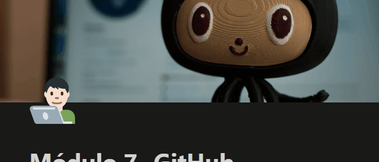

# Projeto com README
Um projeto de teste com um arquivo README 🤓

[](https://google.com)

## Tecnologia utilizadas

- HTML

- CSS

- JS

## Como utilizar

1 - Clone o projeto
```
Git clone <url>
```

2 - Acessar a pasta do projeto 
```
cd repositorio_com_readme <url>
```